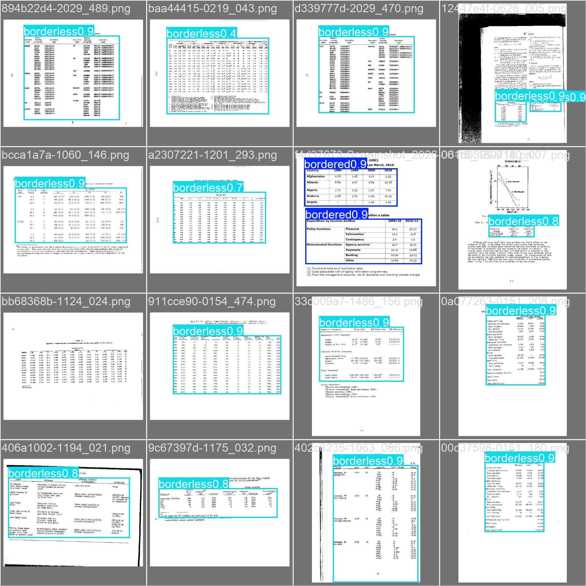
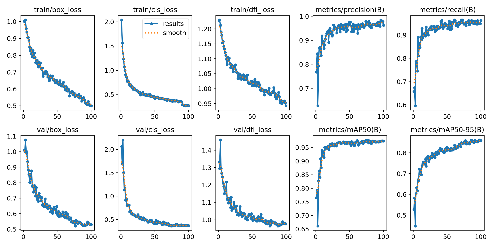

# Table Classifier (YOLOv8)


An end-to-end computer vision project for detecting and classifying tables in document images into **bordered** and **borderless** tables using YOLOv8.



---

## 📌 Overview

Document structure recognition and tabular data extraction often rely heavily on accurate table detection. This repository provides scripts and pipelines for:

- Combining real document datasets with synthetic table datasets using stratified splitting.
- Training a custom YOLOv8 model for table detection.
- Evaluating model metrics (`mAP50`, `mAP50-95`) across **Pooled (Real + Synthetic)** test sets as well as isolated **Real-Only** test sets.
- Verifying class distributions and split balances.

---

## 📊 Results

Evaluated on 100 epochs of training across pooled and real-only document test splits:

| Test set | mAP50 | mAP50-95 | Precision | Recall |
| --- | :---: | :---: | :---: | :---: |
| **Pooled (Real + Synthetic)** | **0.9806** | **0.8570** | 0.963 | 0.968 |
| **Real-Only** | **0.9538** | **0.8310** | 0.926 | 0.927 |



**Class distribution across splits (`dataset_combined`):**

```
train:  bordered=503  borderless=560  (Total: 1063 annotations across 789 images)
val:    bordered=169  borderless=187  (Total: 356 annotations across 253 images)
test:   bordered=167  borderless=195  (Total: 362 annotations across 263 images)
```

---

## 📂 Project Structure

```
Project-1-Tb-DTC/
├── README.md                 # Project documentation
├── requirements.txt          # Pinned dependencies
├── demo.py                   # 2-minute quick single-image inference demo
├── yolov8n.pt                # Pretrained YOLOv8 base weights
│
├── docs/                     # Documentation assets (plots & detection samples)
│   ├── example_detection.jpg
│   └── training_curves.png
│
├── src/                      # Source scripts
│   ├── dataset_builder.py    # Merges real + synthetic pools with stratified ratios
│   ├── dataset_generator.py  # Synthetic document page generator
│   ├── dataset_verifier.py   # Verifies class distribution and split balance
│   ├── evaluate.py           # Evaluates model on pooled vs real-only test splits
│   ├── db_logger.py          # Log detection outputs to SQLite database
│   └── inference_menu.py     # Interactive model inference testing menu
│
├── dataset/                  # Original annotated real dataset
├── dataset_combined/         # Pooled train/val/test dataset & manifest.csv
└── runs/                     # YOLOv8 training outputs, weights, and evaluation runs
```

---

## 🚀 Getting Started

### Prerequisites

Python 3.8+ is required.

```bash
git clone https://github.com/thulungaboro/Table-Classifier.git
cd Table-Classifier
pip install -r requirements.txt
```

### Dataset

- **Real images**: Annotated real-world document pages (scanned documents & PDF page renders) with labels for bordered and borderless table regions.
- **Synthetic images**: Generated programmatically via `src/dataset_generator.py` simulating table layouts and text formatting.
- **Combined Split**: Built using `src/dataset_builder.py` to balance real data (skewed to val/test) and synthetic data (skewed to train), tracked via `manifest.csv`.

---

## 🛠️ Usage

### 1. Generate Synthetic Dataset
```bash
python src/dataset_generator.py --out synth_pool --num 500 --neg_ratio 0.15
```

### 2. Build Combined Dataset

Combine scarce real-world annotations with synthetic datasets while maintaining class balance and generating a `manifest.csv` tracking data origin:

```bash
python src/dataset_builder.py \
    --real_images dataset/images/train dataset/images/val \
    --real_labels dataset/labels/train dataset/labels/val \
    --synth_images synth_pool/images \
    --synth_labels synth_pool/labels \
    --out dataset_combined
```

### 3. Verify Dataset Split Balance

```bash
python src/dataset_verifier.py dataset_combined
```

### 4. Model Evaluation

```bash
python src/evaluate.py
```

### 5. Interactive Inference Menu

```bash
python src/inference_menu.py
```

### 6. Quick Demo

Run inference on a single image and save an annotated output:

```bash
python demo.py --image table_test.jpg --weights runs/detect/train/weights/best.pt --out docs/example_detection.jpg
```

---

## 🏷️ Data & Classes

| ID | Class        | Description                                  |
|----|--------------|-----------------------------------------------|
| 0  | `bordered`   | Tables with explicit borders/grid lines       |
| 1  | `borderless` | Tables without explicit column/row lines      |

---

## 🗺️ Roadmap

- [ ] Add table structure recognition (rows/columns) on top of detection
- [ ] Export model to ONNX for fast production inference
- [ ] Add a Google Colab notebook for interactive demonstration

---

## 🤝 Contributing

Issues and pull requests are welcome. Please open an issue first to discuss any major changes.
